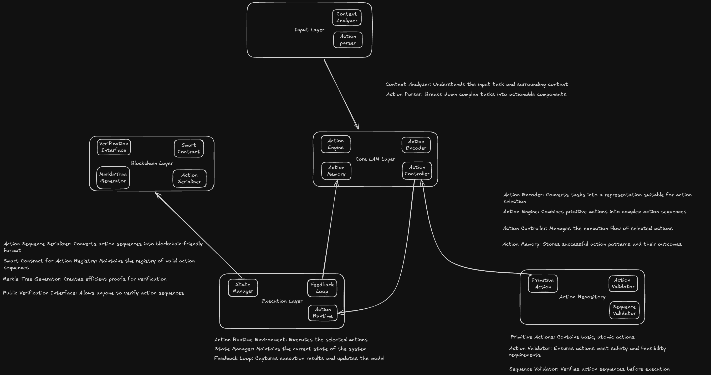

# Action-Based LLM Architecture with Blockchain Integration

## Overview
This project implements a Large Action Model (LAM) for AI agents that uses an action-based architecture instead of traditional plugin-based approaches. The system records action sequences on the Solana blockchain to ensure traceability and transparency of agent operations.

## Architecture Diagram

## Key Components

### 1. Action Layer
- **Action Definitions**: Structured action templates defining possible operations
- **Action Registry**: Central repository of available actions
- **Action Validator**: Ensures actions are properly formed before execution

### 2. Execution Layer
- **Action Dispatcher**: Routes actions to appropriate handlers
- **Action Executors**: Specialized modules that implement specific actions
- **State Manager**: Tracks system state between actions
- **Blockchain Recorder**: Records action sequences to Solana blockchain

### 3. Blockchain Integration
- **Solana Client**: Handles communication with Solana blockchain
- **Action Recorder**: Records action sequences as transactions
- **Sequence Verifier**: Validates action sequences against blockchain records
- **Transaction Builder**: Creates Solana transactions from action sequences

### 4. AI Core
- **LLM Interface**: Connects to large language model for decision making
- **Action Planner**: Generates action sequences based on LLM output
- **Feedback Analyzer**: Processes results and updates action strategies

## Blockchain Integration Details
The system uses Solana blockchain to:
1. Record each action sequence as an immutable transaction
2. Provide transparent audit trail of agent operations
3. Enable verification of action sequence integrity
4. Support decentralized consensus on action history
5. Ensure cryptographic proof of action execution order

## License
MIT License - See LICENSE file for details
